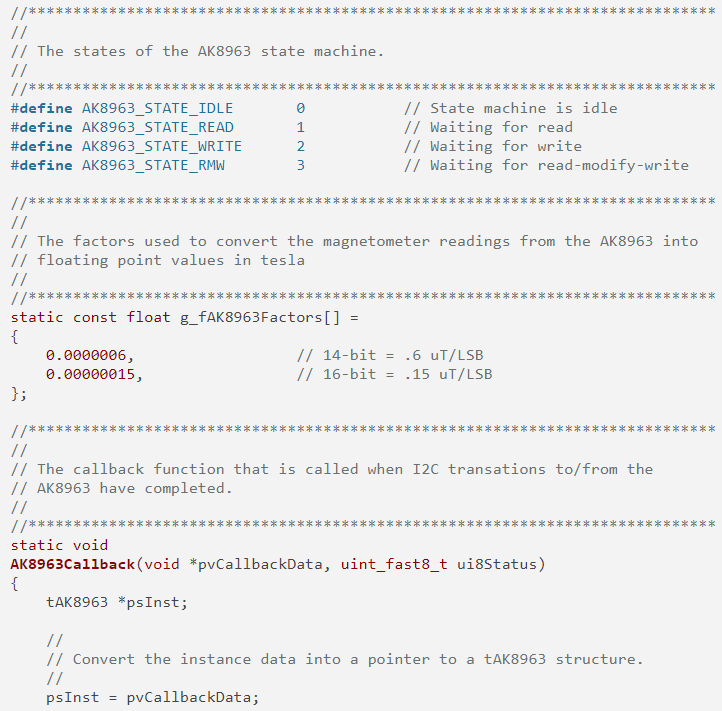
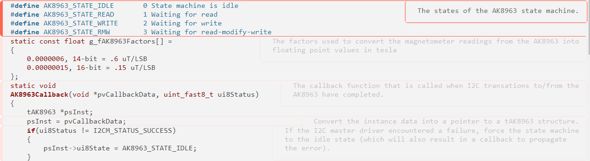

# TI Documented Code Annotation Viewer

source code                | application view
:-------------------------:|:-------------------------:
  |  

## Controls
- Drag and drop a .c / .h file onto [the app](https://novasagittarii.github.io/ti-docs-annotation-viewer)
- Hover over a section to show the entire annotation (comment block above it).
- Hover over the annotation to hide it if it happens to cover source code.